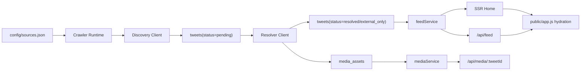

# 架构说明

## 当前定位

项目当前采用“分层单体”结构，而不是多服务拆分。

这样做的目标是：

- 保持单机部署简单
- 把抓取、解析、存储、SSR、前端 hydration 的边界理清
- 让后续重构优先发生在模块边界，而不是重写技术栈

## 分层结构

### 1. App Runtime

目录：

- `server/app/runtime.js`
- `server/app/crawlerRuntime.js`
- `server/app/httpRuntime.js`
- `server/app/schedulerRuntime.js`

职责：

- 解析配置
- 组装 DB、crawler、HTTP server、scheduler
- 根据场景决定是否启用 HTTP 和 scheduler

约束：

- 这里只做装配，不写业务规则
- CLI 场景应优先复用 runtime，而不是重新拼依赖

### 2. HTTP Layer

目录：

- `server/http/api/*`
- `server/http/pageRoutes.js`

职责：

- 暴露 JSON API
- 返回 SSR 页面
- 把 service / crawler 返回值映射成 HTTP 响应

约束：

- 不直接写 SQL
- 不直接操作 Playwright
- 不做复杂业务编排

### 3. Services Layer

目录：

- `server/services/feedService.js`
- `server/services/mediaService.js`
- `server/services/crawl/*`
- `server/crawler.js`

职责：

- 聚合用例
- 处理 feed view model
- 处理媒体代理
- 编排 discover / resolve / backoff 过程

说明：

- `server/crawler.js` 现在是 facade
- 具体 crawl phase 已经拆到 `server/services/crawl/`

### 4. Infra Layer

目录：

- `server/infra/discovery/*`
- `server/infra/resolve/*`

职责：

- 对接 Jina discovery
- 对接 Playwright resolver
- 包装 discovery fallback 策略

约束：

- 这里允许直接调用外部系统
- 不应该关心 Express、SSR 或页面结构

兼容层：

- `server/discoveryClient.js`
- `server/jinaDiscovery.js`
- `server/xResolver.js`

这些文件现在只做兼容导出。新代码应优先从 `server/infra/` 引用。

### 5. DB Layer

目录：

- `server/db.js`
- `server/db/readModel.js`
- `server/db/writeRepository.js`
- `server/db/migrations/*`

职责：

- 维护 SQLite 连接
- 执行显式 migration
- 提供 read model
- 提供 write repository

说明：

- schema 变更不再通过启动时隐式 `ALTER TABLE` 完成
- 所有历史演进都记录在 `schema_migrations`

### 6. Page / Render Layer

目录：

- `server/pages/home/*`
- `shared/feed/*`
- `public/render.js`

职责：

- `server/pages/home/*`: SSR 页面骨架
- `shared/feed/*`: 前后端共享的 feed 映射、格式化、模板
- `public/render.js`: 浏览器端兼容入口

约束：

- SSR 不再直接依赖 `public/` 下的实现文件
- 共享模板优先放到 `shared/`

### 7. Browser Layer

目录：

- `public/app.js`
- `public/app/*`
- `public/videoPreview.js`
- `public/vendor/*`

职责：

- hydration
- feed 加载
- 详情弹窗
- hover preview / detail player
- 本地 vendor 静态资源加载

说明：

- 第三方前端依赖已经本地化到 `public/vendor`
- 页面不再依赖 CDN

## 主链路

## 运行模式

### Web 服务

入口：

- `server/index.js`

行为：

- 启动 HTTP server
- 启动 scheduler
- 触发 initial crawl

### 批处理 CLI

入口：

- `server/crawlOnce.js`
- `server/resolvePending.js`
- `server/backfillAvatars.js`

行为：

- 只创建 crawler runtime
- 不启动 HTTP
- 不启动 interval scheduler

### 数据库迁移

入口：

- `server/migrate.js`

行为：

- 显式执行 migration
- 输出本次应用的 migration id

### 登录态维护

入口：

- `server/auth.js`

行为：

- 打开 Playwright 浏览器
- 复用本地 browser profile 保存 X 登录态

## 数据模型

核心表：

- `sources`: 抓取来源
- `tweets`: tweet 元数据、状态、原始 payload
- `media_assets`: 可播放媒体
- `crawl_runs`: discover / resolve 执行记录
- `schema_migrations`: 已执行 migration

状态流转：

- `pending`
- `resolved`
- `external_only`
- `skipped`
- `failed`

## 配置约定

关键环境变量：

- `PORT`
- `DB_PATH`
- `BROWSER_PROFILE_DIR`
- `X_STORAGE_STATE_PATH`
- `SCRAPE_INTERVAL_MINUTES`
- `DISCOVERY_MODE`
- `MEDIA_PROXY_TIMEOUT_MS`
- `RUN_MIGRATIONS_ON_BOOT`

约束：

- 默认允许启动时自动迁移
- 生产环境更推荐先执行 `npm run db:migrate`，再启动服务

## 工程约束

新增代码时优先遵循下面的落点规则：

- 新的外部依赖适配器放 `server/infra`
- 新的业务用例放 `server/services`
- 新的 API 路由放 `server/http/api`
- 新的 SSR 页面放 `server/pages`
- 新的共享模板或 formatter 放 `shared`
- 新的数据库演进放 `server/db/migrations`

应避免的做法：

- 在 `server/` 根目录继续堆新实现
- 在路由里直接写 SQL
- 在 SSR 层直接依赖浏览器专用模块
- 通过启动时隐式修表完成 schema 演进
- 重新引入 CDN 作为运行时硬依赖

## 当前还值得继续优化的点

按优先级看，后续还值得做的主要是：

1. 给 `crawl_runs` 和 backoff 增加更明确的运行状态模型
2. 把 `server/crawler.js` 进一步收窄成纯 facade，减少保留逻辑
3. 为 `server/infra/resolve/playwrightResolver.js` 继续拆分 payload 解析与浏览器控制
4. 补更接近生产的启动与迁移文档，例如部署顺序和故障恢复

配套运维细节见：

- `docs/operations.md`
